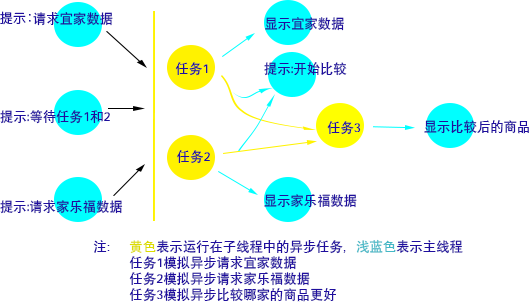

# 目的
android中，对异步编程进行对比，进而选择最合适的实现方式

# 模拟需求
分别从宜家、家乐福获取桌子的信息，获取到后两者进行比较，挑选出最合意的桌子。



# 线程
用最基础的线程Thread来实现
```kotlin
    override fun requestServer() {
        view.displayIKEAGoods(Resource(Resource.LOADING))
        view.displayCarrefourGoods(Resource(Resource.LOADING))
        view.displayBetterGoods(Resource(Resource.WAITING))

        var ikeaGoods: Goods? = null
        var carrefourGoods: Goods? = null

        val uiTask = { action: () -> Unit ->
            mainThreadHandler.post {
                if (canceled) return@post

                action()
                safeLet(ikeaGoods, carrefourGoods) { it0, it1 ->
                    betterGoods(it0, it1)
                }
            }
        }

        threads += Thread {
            try {
                val goods = backendWork.getGoodsFromIKEA()
                uiTask {
                    ikeaGoods = goods
                    view.displayIKEAGoods(Resource(Resource.FINISH, goods))
                }
            } catch (e: InterruptedException) {
                e.printStackTrace()
            } finally {
                val currentThread = Thread.currentThread()
                mainThreadHandler.post {
                    threads -= currentThread
                }
            }
        }.apply { start() }

        threads += Thread {
            try {
                val goods = backendWork.getGoodsFromCarrefour()
                uiTask {
                    carrefourGoods = goods
                    view.displayCarrefourGoods(Resource(Resource.FINISH, goods))
                }
            } catch (e: InterruptedException) {
                e.printStackTrace()
            } finally {
                val currentThread = Thread.currentThread()
                mainThreadHandler.post {
                    threads -= currentThread
                }
            }
        }.apply { start() }
    }
```

# thread pool
```kotlin
    override fun requestServer() {
        view.displayIKEAGoods(Resource(Resource.LOADING))
        view.displayCarrefourGoods(Resource(Resource.LOADING))
        view.displayBetterGoods(Resource(Resource.WAITING))

        val ikeaFuture = backendExecutor.submit<Goods> {
            backendWork.getGoodsFromIKEA().alsoPostToUI {
                view.displayIKEAGoods(Resource(Resource.FINISH, it))
            }
        }

        val carrefourFuture = backendExecutor.submit<Goods> {
            backendWork.getGoodsFromCarrefour().alsoPostToUI {
                view.displayCarrefourGoods(Resource(Resource.FINISH, it))
            }
        }

        backendExecutor.submit<Goods> {
            val ikeaGoods = ikeaFuture.get()
            val carrefourGoods = carrefourFuture.get()

            mainHandler.post {
                view.displayBetterGoods(
                    Resource(
                        Resource.LOADING,
                        "start compare which one is better"
                    )
                )
            }

            backendWork.selectBetterOne(ikeaGoods, carrefourGoods).alsoPostToUI {
                view.displayBetterGoods(Resource(Resource.FINISH, it))
            }
        }
    }
```
## future
## shutdown和shutdownNow
## 异常处理

# completefuture
```kotlin
    override fun requestServer() {
        view.displayIKEAGoods(Resource(Resource.LOADING))
        view.displayCarrefourGoods(Resource(Resource.LOADING))
        view.displayBetterGoods(Resource(Resource.WAITING))


        val ikeaFuture = CompletableFuture.supplyAsync(Supplier {
            backendWork.getGoodsFromIKEA()
        }, backendExecutor).apply {
            thenAcceptAsync(Consumer {
                view.displayIKEAGoods(Resource(Resource.FINISH, it))
            }, mainThreadExecutor)

            futures += this
        }

        val carrefourFuture = CompletableFuture.supplyAsync(Supplier {
            backendWork.getGoodsFromCarrefour()
        }, backendExecutor).apply {
            thenAcceptAsync(Consumer {
                view.displayCarrefourGoods(Resource(Resource.FINISH, it))
            }, mainThreadExecutor)

            futures += this
        }

        futures += ikeaFuture.thenCombineAsync(
            carrefourFuture,
            BiFunction<Goods, Goods, Pair<Goods, Goods>> { g0, g1 ->
                view.displayBetterGoods(Resource(Resource.LOADING))
                Pair(g0, g1)
            },
            mainThreadExecutor
        ).thenApplyAsync(java.util.function.Function<Pair<Goods, Goods>, Goods> {
            backendWork.selectBetterOne(it.first, it.second)
        }, backendExecutor).thenAcceptAsync(Consumer<Goods> {
            view.displayBetterGoods(Resource(Resource.FINISH, it))
        }, mainThreadExecutor)
    }
```
## supply
## apply
## accept

# rxjava
```kotlin
    override fun requestServer() {
        view.displayIKEAGoods(Resource(Resource.LOADING))
        view.displayCarrefourGoods(Resource(Resource.LOADING))
        view.displayBetterGoods(Resource(Resource.WAITING))

        val ikeaObservable = goodsModel.getGoodsFromIKEAAsync()
            .observeOn(AndroidSchedulers.mainThread())
            .doOnNext {
                view.displayIKEAGoods(Resource(Resource.FINISH, it))
            }

        val carrefourObservable = goodsModel.getGoodsFromCarrefourAsync()
            .observeOn(AndroidSchedulers.mainThread())
            .doOnNext {
                view.displayCarrefourGoods(Resource(Resource.FINISH, it))
            }

        compositeDisposable += Observable.zip(
            ikeaObservable,
            carrefourObservable,
            BiFunction { t1: Goods, t2: Goods ->
                view.displayBetterGoods(Resource(Resource.LOADING))
                Pair(t1, t2)
            }).flatMap {
            goodsModel.selectBetterOneAsync(it.first, it.second)
        }.observeOn(AndroidSchedulers.mainThread())
            .subscribe {
                view.displayBetterGoods(Resource(Resource.FINISH, it))
            }
    }
```
## 操作符
## 异常处理

# 协程
```kotlin
    override fun requestServer() {
        uiScope.launch {
            val deferredIKEAGoods = goodsModel.getGoodsFromIKEAAsync()
            val deferredCarrefourGoods = goodsModel.getGoodsFromCarrefourAsync()

            view.displayIKEAGoods(Resource(Resource.LOADING))
            view.displayCarrefourGoods(Resource(Resource.LOADING))

            launch {
                val goods = deferredIKEAGoods.await()
                view.displayIKEAGoods(Resource(Resource.FINISH, goods))
            }

            launch {
                val goods = deferredCarrefourGoods.await()
                view.displayCarrefourGoods(Resource(Resource.FINISH, goods))
            }

            view.displayBetterGoods(Resource(Resource.WAITING))

            val ikeaGoods = deferredIKEAGoods.await()
            val carrefourGoods = deferredCarrefourGoods.await()

            view.displayBetterGoods(Resource(Resource.LOADING))

            val betterGoods = goodsModel.selectBetterOneAsync(supervisorJob, ikeaGoods, carrefourGoods).await()
            view.displayBetterGoods(Resource(Resource.FINISH, betterGoods))
        }
    }
```
## 协程上下文
## runblock
## launch
### GlobleScope
### CoroutineScope