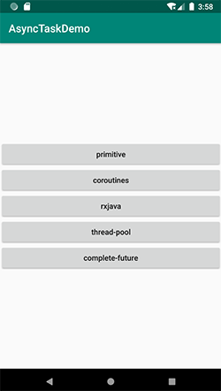
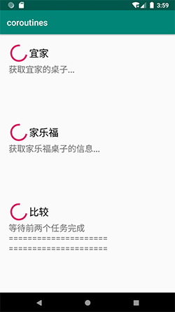

# 目的
android中，对异步编程进行对比，进而选择最合适的实现方式

# 模拟需求
分别从宜家、家乐福获取商品桌子的信息，获取到后两者进行比较，挑选出最合意的桌子。依赖关系如下图所示。


UI效果图如下所示：

      

大概业务逻辑是这样：
1. 在UI上分别显示："正在请求宜家数据..."，"正在请求家乐福数据..."，"等待任务1和任务2...";
2. 开启异步任务，并发请求宜家数据和家乐福数据;
3. 当宜家数据请求成功后，把商品信息显示在UI上;
4. 当家乐福数据请求成功后，同时也把商品信息显示在UI上；
5. 第3步和第4步没有先后顺序；
6. 当第3步中的宜家数据和第4步中家乐福数据都请求下来后，开启新的异步任务，比较两家商品谁更好。同时在UI上显示："开始比较"
7. 有了比较结果后，把比较结果（哪家商品更好）显示到UI上。

以下分别用基础的线程、线程池、java8支持的completefuture、rxjava、协程来实现。
需要注意的是，当用户取消任务（从当前activity返回）时，我们要去调用cancel方法。ikea表示宜家，carrefour表示家乐福,goods表示商品(这里我们用买桌子来做比喻)。

# 线程
用最基础的线程Thread来实现。需要注意如下几点：
* cancel时，需要调用Thread的interrupt方法，同时设置标记量canceled为true
* 线程中捕获InterruptedException，检查标记量canceled
* uiTask中判断ikeaGoods和carrefourGoods是否都具备了，否则不可以去调用betterGoods去做商品比较
* canceled没有被标记为@Volatile，因为目前只在主线程中访问了canceled

```kotlin
    override fun requestServer() {
        view.displayIKEAGoods(Resource(Resource.LOADING))
        view.displayCarrefourGoods(Resource(Resource.LOADING))
        view.displayBetterGoods(Resource(Resource.WAITING))

        var ikeaGoods: Goods? = null
        var carrefourGoods: Goods? = null

        val uiTask = { action: () -> Unit ->
            mainThreadHandler.post {
                if (canceled) return@post

                action()
                safeLet(ikeaGoods, carrefourGoods) { it0, it1 ->
                    betterGoods(it0, it1)
                }
            }
        }

        threads += Thread {
            try {
                val goods = backendWork.getGoodsFromIKEA()
                uiTask {
                    ikeaGoods = goods
                    view.displayIKEAGoods(Resource(Resource.FINISH, goods))
                }
            } catch (e: InterruptedException) {
                e.printStackTrace()
            } finally {
                val currentThread = Thread.currentThread()
                mainThreadHandler.post {
                    threads -= currentThread
                }
            }
        }.apply { start() }

        threads += Thread {
            try {
                val goods = backendWork.getGoodsFromCarrefour()
                uiTask {
                    carrefourGoods = goods
                    view.displayCarrefourGoods(Resource(Resource.FINISH, goods))
                }
            } catch (e: InterruptedException) {
                e.printStackTrace()
            } finally {
                val currentThread = Thread.currentThread()
                mainThreadHandler.post {
                    threads -= currentThread
                }
            }
        }.apply { start() }
    }
    
    private fun betterGoods(ikeaGoods: Goods, carrefourGoods: Goods) {
        view.displayBetterGoods(Resource(Resource.LOADING))

        threads += Thread {
            try {
                val goods = backendWork.selectBetterOne(ikeaGoods, carrefourGoods)

                mainThreadHandler.post {
                    if (canceled) return@post

                    view.displayBetterGoods(Resource(Resource.FINISH, goods))
                }
            } catch (e: InterruptedException) {
                e.printStackTrace()
            } finally {
                val currentThread = Thread.currentThread()
                mainThreadHandler.post {
                    threads -= currentThread
                }
            }
        }.apply { start() }
    }
```

## cancel
```kotlin
    override fun cancel() {
        canceled = true
        threads.forEach { it.interrupt() }
    }
```

不过，android直接用Thread做异步任务的实现，已经很少了。它本身更容易出错，而且难度大一些，要去理清同步互斥，锁的操作等。

# thread pool

android开发，经常要直接接触线程池的使用和设计。针对上边的业务需求，这个是使用线程池的实现版本。
我们用到了`ikeaFuture.get()`和`carrefourFuture.get()`，用于模拟等待任务1和任务2。

```kotlin
    override fun requestServer() {
        view.displayIKEAGoods(Resource(Resource.LOADING))
        view.displayCarrefourGoods(Resource(Resource.LOADING))
        view.displayBetterGoods(Resource(Resource.WAITING))

        val ikeaFuture = backendExecutor.submit<Goods> {
            backendWork.getGoodsFromIKEA().alsoPostToUI {
                view.displayIKEAGoods(Resource(Resource.FINISH, it))
            }
        }

        val carrefourFuture = backendExecutor.submit<Goods> {
            backendWork.getGoodsFromCarrefour().alsoPostToUI {
                view.displayCarrefourGoods(Resource(Resource.FINISH, it))
            }
        }

        backendExecutor.submit<Goods> {
            val ikeaGoods = ikeaFuture.get()
            val carrefourGoods = carrefourFuture.get()

            mainHandler.post {
                view.displayBetterGoods(
                    Resource(
                        Resource.LOADING,
                        "start compare which one is better"
                    )
                )
            }

            backendWork.selectBetterOne(ikeaGoods, carrefourGoods).alsoPostToUI {
                view.displayBetterGoods(Resource(Resource.FINISH, it))
            }
        }
    }
    
    private fun Goods.alsoPostToUI(task: (Goods) -> Unit): Goods {
        mainHandler.post {
            task(this)
        }

        return this
    }
```

## cancel

需要调用线程池的shutdownNow，这里没有调用shutdown。shutdownNow不仅取消了等待队列中的任务，而且对正在执行的任务也会通知interrupt。

```kotlin
    override fun cancel() {
        backendExecutor.shutdownNow()
    }
```

## future
## 异常处理

# completefuture

java8开始支持CompletableFuture，不过要在android N及更高的版本才支持。
```kotlin
    override fun requestServer() {
        view.displayIKEAGoods(Resource(Resource.LOADING))
        view.displayCarrefourGoods(Resource(Resource.LOADING))
        view.displayBetterGoods(Resource(Resource.WAITING))


        val ikeaFuture = CompletableFuture.supplyAsync(Supplier {
            backendWork.getGoodsFromIKEA()
        }, backendExecutor).apply {
            thenAcceptAsync(Consumer {
                view.displayIKEAGoods(Resource(Resource.FINISH, it))
            }, mainThreadExecutor)

            futures += this
        }

        val carrefourFuture = CompletableFuture.supplyAsync(Supplier {
            backendWork.getGoodsFromCarrefour()
        }, backendExecutor).apply {
            thenAcceptAsync(Consumer {
                view.displayCarrefourGoods(Resource(Resource.FINISH, it))
            }, mainThreadExecutor)

            futures += this
        }

        futures += ikeaFuture.thenCombineAsync(
            carrefourFuture,
            BiFunction<Goods, Goods, Pair<Goods, Goods>> { g0, g1 ->
                view.displayBetterGoods(Resource(Resource.LOADING))
                Pair(g0, g1)
            },
            mainThreadExecutor
        ).thenApplyAsync(java.util.function.Function<Pair<Goods, Goods>, Goods> {
            backendWork.selectBetterOne(it.first, it.second)
        }, backendExecutor).thenAcceptAsync(Consumer<Goods> {
            view.displayBetterGoods(Resource(Resource.FINISH, it))
        }, mainThreadExecutor)
    }
```

```kotlin
    override fun cancel() {
        futures.forEach {
            it.cancel(true)
        }
    }
```

## supply
## apply
## accept

# rxjava
```kotlin
    override fun requestServer() {
        view.displayIKEAGoods(Resource(Resource.LOADING))
        view.displayCarrefourGoods(Resource(Resource.LOADING))
        view.displayBetterGoods(Resource(Resource.WAITING))

        val ikeaObservable = goodsModel.getGoodsFromIKEAAsync()
            .observeOn(AndroidSchedulers.mainThread())
            .doOnNext {
                view.displayIKEAGoods(Resource(Resource.FINISH, it))
            }

        val carrefourObservable = goodsModel.getGoodsFromCarrefourAsync()
            .observeOn(AndroidSchedulers.mainThread())
            .doOnNext {
                view.displayCarrefourGoods(Resource(Resource.FINISH, it))
            }

        compositeDisposable += Observable.zip(
            ikeaObservable,
            carrefourObservable,
            BiFunction { t1: Goods, t2: Goods ->
                view.displayBetterGoods(Resource(Resource.LOADING))
                Pair(t1, t2)
            }).flatMap {
            goodsModel.selectBetterOneAsync(it.first, it.second)
        }.observeOn(AndroidSchedulers.mainThread())
            .subscribe {
                view.displayBetterGoods(Resource(Resource.FINISH, it))
            }
    }
```

```kotlin
    override fun cancel() {
        compositeDisposable.dispose()
    }
```

## 操作符
## 异常处理

# 协程
```kotlin
    override fun requestServer() {
        uiScope.launch {
            val deferredIKEAGoods = goodsModel.getGoodsFromIKEAAsync()
            val deferredCarrefourGoods = goodsModel.getGoodsFromCarrefourAsync()

            view.displayIKEAGoods(Resource(Resource.LOADING))
            view.displayCarrefourGoods(Resource(Resource.LOADING))

            launch {
                val goods = deferredIKEAGoods.await()
                view.displayIKEAGoods(Resource(Resource.FINISH, goods))
            }

            launch {
                val goods = deferredCarrefourGoods.await()
                view.displayCarrefourGoods(Resource(Resource.FINISH, goods))
            }

            view.displayBetterGoods(Resource(Resource.WAITING))

            val ikeaGoods = deferredIKEAGoods.await()
            val carrefourGoods = deferredCarrefourGoods.await()

            view.displayBetterGoods(Resource(Resource.LOADING))

            val betterGoods = goodsModel.selectBetterOneAsync(supervisorJob, ikeaGoods, carrefourGoods).await()
            view.displayBetterGoods(Resource(Resource.FINISH, betterGoods))
        }
    }
```

```kotlin
    override fun cancel() {
        supervisorJob.cancel()
    }
```

## 协程上下文
## runblock
## launch
### GlobleScope
### CoroutineScope

# 小结
* CompletableFuture虽然早已被java8支持，但是只能在android N及更高版本才可以使用；
* 使用thread做异步的业务逻辑处理，虽然操作的粒度很细，但是要照顾的细节太多，还要理清锁和同步互斥，开发效率并不会提高；
* 若使用线程池，对于任务的依赖关系只能用简单的future的get来处理，实现任务依赖的能力过于单薄；
* rxjava的代码量相对就少很多，对依赖关系处理能力强，可以轻松进行线程切换，若条件允许，建议使用rxjava；
* kotlin通过扩展包的方式支持了协程，可是在android上java还不支持协程。在纯kotlin项目中，相对rxjava，协程更轻量级，异步任务处理能力也挺强；
* 但是若是在java+kotlin混合项目中，协程则不能充分应用项目工程所有地方(仅在kotlin代码中使用)。此时为了工程保持接口统一，也可能需要放弃使用协程了。